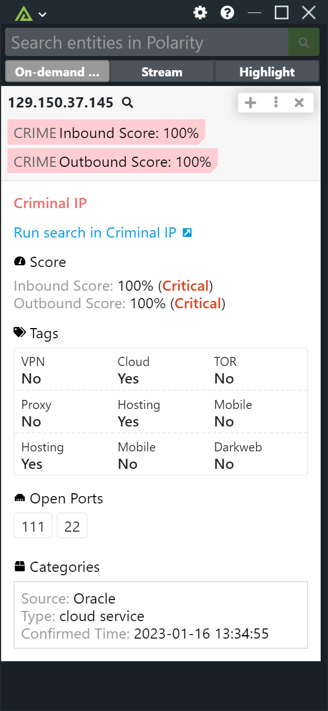

# Polarity Criminal IP Integration

The Polarity Criminal IP integration returns information from Criminal IP on IPv4 addresses.

## Search Throttling

The Criminal IP REST API only allows 1 outstanding search at a time per API key.  As a result, searches to the integration will be run in order serially.  The integration will queue up to 15 searches at a time per API key in use.  Once the search queue is filled, Polarity will
return a message in the Overlay Window indicating the search limit has been reached and provide an option to retry the search.

## Integration Options

### Criminal IP API key
A valid API Key is needed in order to access the Criminal IP dataset. Please see https://www.criminalip.io/ to sign up for an account.

## Installation Instructions

Installation instructions for integrations are provided on the [PolarityIO GitHub Page](https://polarityio.github.io/).

## Polarity

Polarity is a memory-augmentation platform that improves and accelerates analyst decision-making.  For more information about the Polarity platform please see:

https://polarity.io/
